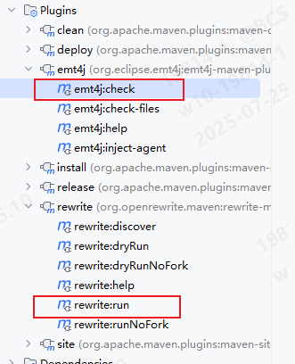
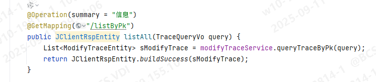
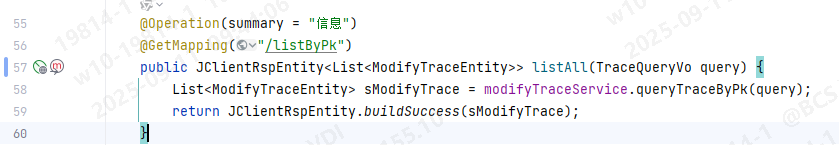
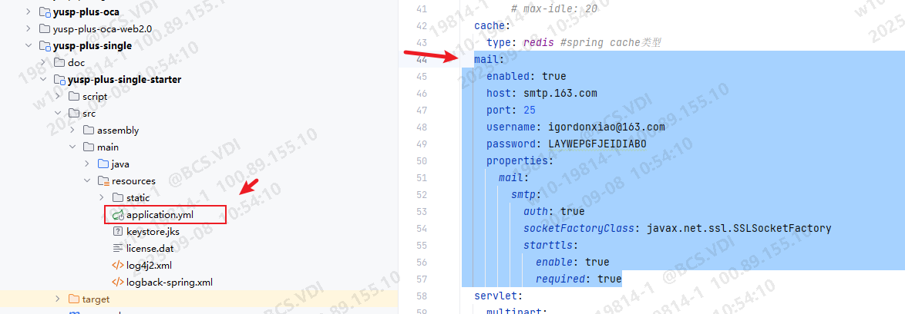
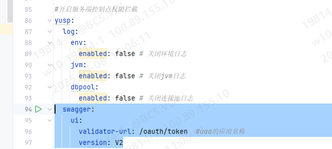
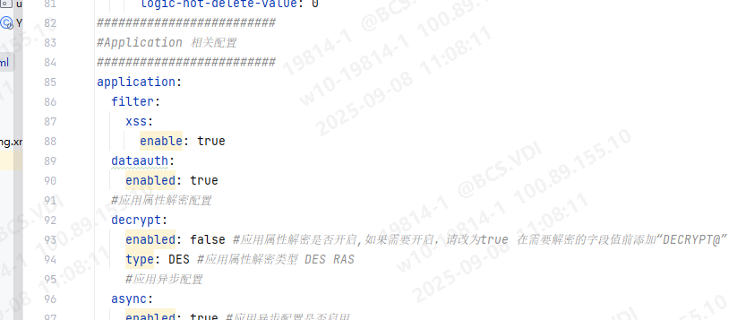
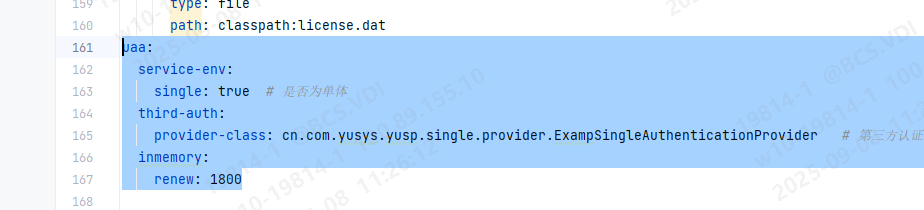
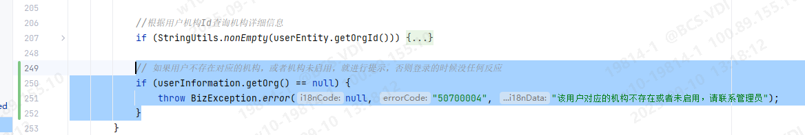
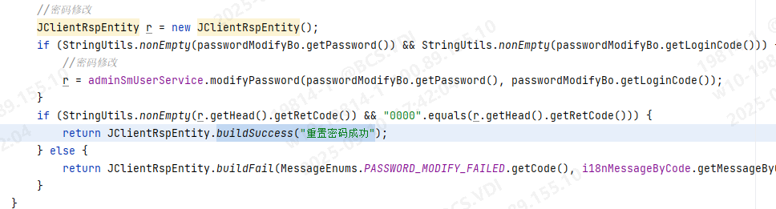

## OCA_PLUS JDK Update Report

### 1. 项目升级初始化动作

考虑到 maven-flatten 插件和 openrewrite 插件不兼容，移除 maven-flatten 插件：将版本号更新成一个移除了 flatten-maven-plugin 的版本（flatten-maven-plugin 在父pom中引入，子pom无法移除），并且将所有用到了 `<version>${revision}</version>` 的地方替换为实际的版本号

执行 emt4j:check 生成初始的报告，能知道自己项目中有哪些代码不兼容，以及依赖的第三方包有哪些不兼容；

然后执行 rewrite:run，会批量的将一些jdk8和spring2.x不兼容的地方修改为 jdk17 和 spring3.4.5 兼容的代码（但是无法完全一键处理）



手动将一些定义 maven 编译版本的地方进行修改：

```xml
<maven.compiler.source>17</maven.compiler.source>
<maven.compiler.target>17</maven.compiler.target>
```

删除 yusp-plus-extend 模块下的 yusp-plus-message-core（早已被移除模块，本次删除存量无用代码） 和 yusp-plus-routing-extend（无实际使用，可安全移除）模块。

移除 yusp-plus-oca-core 模块 pom 中的 spring-security-jwt 依赖：该依赖在 spring6.x 中不再支持，先移除，确保 maven 能正常引入新的依赖。

修改底层包 版本号为：V4.0.0.20250514-SNAPSHOT，并刷新 maven 依赖

修改 yusp-plus-single-starter pom.xml 中的 plugin 版本，将` <fork>true</fork>` 都进行移除

升级 tongweb 版本，适配 SpringBoot 3.x 和 JDK17，原 `com.tongweb:tongweb-embed-el` 需要替换为 `com.tongweb:tongweb-embed-el-3.x`，`com.tongweb:tongweb-embed-core` 需要替换为 `com.tongweb:tongweb-embed-core-3.x`，`com.tongweb.springboot:tongweb-spring-boot-starter-2.x` 需要替换为 `com.tongweb.springboot:tongweb-spring-boot-starter-3.x`，且版本都需升级至 7.0.E.6_P14（底层做了版本控制，引入依赖时，可以无需指明版本号）

### 2. 编译错误修复

执行 maven compile，会得到很多的编译错误：

- MybatisPlusConfig：修复 DynamicTableNameInnerInterceptor setTableNameHandlerMap方法被移除的问题。修改方法：可以直接复制平台组修改后的 MybatisPlusConfig，然后如果项目组有自定义的逻辑，可以自行进行迁移。
- getBaseMapper().selectCount 等一系列方法响应值从 int 替换成 long，或者从 Integer 替换成 Long
- IdType.UUID 被移除，需要批量替换成 IdType.ASSIGN_UUID
- YuspTenantLineInnerInterceptor：复制平台组的 YuspTenantLineInnerInterceptor 即可。
- yusp-plus-single-starter 中的 BeanConfig 直接移除：springfox 被移除，该配置类已经无用。同步移除 pom.xml 中的 udp-base-swagger-ui 依赖
- WebSecurityConfig：复制平台组的即可。若有自定义逻辑，可自行进行迁移
- MybatisPlus 3.5.12 中，将 FieldStrategy.IGNORED 枚举进行移除，可以无感替换为 FieldStrategy.ALWAYS


### 3. 代码优化

- 移除 yusp-plus-oca-starter 模块，仅保留单体服务入口

异常处理：

1. 移除 UaaWebResponseExceptionTranslator，异常的处理在新版本中通过 `OAuth2TokenEndpointFilter` 中的 `authenticationFailureHandler` 处理，默认是 `OAuth2ErrorAuthenticationFailureHandler`，将认证过程中抛出的异常转换成 OAuth2 标准异常返回，即 OAuth2Error。


**3.1、优化统一结果响应**：`JClientRspEntity` 统一添加泛型处理，用于修复编辑器的警告

> 1. 注意如果一个接口同时存在 `buildSuccess` 和 `buildFail`，以前是用 `JClientRspEntity<Object>` 接收，现在需要将响应的泛型修改为 `JClientRspEntity<?>`。
> 2. 由于以前版本未强制要求泛型，从而导致部分存量代码泛型标注错误，这部分需要项目组进行修复。

优化前：



优化后：




### 4. 配置优化

1、移除 application.yaml 中，`spring.mail.*` 相关的配置



2、移除 `yusp-plus-single/yusp-plus-single-starter/src/main/resources/logback-spring.xml` 文件，统一使用 log4j2 日志框架

3、移除 `application.yaml` 中，`yusp.swagger.*` 相关配置



并替换成如下配置，用于开启 `springdoc-swagger`，以及`knife4j ui`：

```yaml
springdoc:
  swagger-ui:
    enabled: true
knife4j:
  enable: true
```

4、移除 `application.yaml` 中全部的 Application 相关配置，这部分内容实际未生效



5、移除 `application.yml` 中 `uaa.*` 相关配置，最新版本统一应用研发平台 OCA-PLUS 已经默认被定义为单体工程



### 5. 问题修复

1、修复当用户所属机构不存在或未启用时，导致登录失败，但未进行任何提示的问题

修复步骤：

1. 数据库中插入数据：

```
INSERT INTO `admin_sm_message` VALUES ('f0cc1003b73ab2b282c6238f5d59ffe6', '50700004', 'error', '该用户对应的机构不存在或者未启用，请联系管理员', 'MODULEINFO', 'oca_smOrg', '40', '2025-09-10 12:59:53', '1');
```

2. SessionServiceImpl getUserInfo 方法添加如下判断（在根据用户机构ID查询机构详情信息后）：

```java
// 如果用户不存在对应的机构，或者机构未启用，就进行提示，否则登录的时候没任何反应
if (userInformation.getOrg() == null) {
    throw BizException.error(null, "50700004", "该用户对应的机构不存在或者未启用，请联系管理员");
}
```



2、优化重置密码时，前端展示不正确的问题

优化步骤：PasswordServiceImpl passwordModification 方法在密码修改成功时，需要 buildSuccess：



3、修复登录时间段限制策略未实现的问题：详见 git 提交记录：`hotfix#1：实现登录时间段限制策略`

4、修复部分 Controller 方法响应 `JClientRspEntity` 泛型不正确的问题，详见本文档 3.1 部分，以及  git 提交记录：`hotfix#2：修复和优化部分 JClientRspEntity 泛型不正确，以及未指定泛型的问题`

### 6. 项目启动注意事项

1. VM 添加：--add-opens=java.base/java.lang=ALL-UNNAMED


```xml
<plugins>
    <plugin>
        <groupId>org.openrewrite.maven</groupId>
        <artifactId>rewrite-maven-plugin</artifactId>
        <version>6.8.0</version>
        <dependencies>
            <dependency>
                <groupId>org.openrewrite.recipe</groupId>
                <artifactId>rewrite-migrate-java</artifactId>
                <version>3.9.0</version>
            </dependency>
            <dependency>
                <groupId>org.openrewrite.recipe</groupId>
                <artifactId>rewrite-spring</artifactId>
                <version>6.7.0</version>
            </dependency>
        </dependencies>
        <configuration>
            <exportDatatables>true</exportDatatables>
            <activeRecipes>
                <recipe>org.openrewrite.java.migrate.UpgradeToJava17</recipe>
                <recipe>org.openrewrite.java.spring.boot3.UpgradeSpringBoot_3_4</recipe>
            </activeRecipes>
        </configuration>
    </plugin>
    <plugin>
        <groupId>org.eclipse.emt4j</groupId>
        <artifactId>emt4j-maven-plugin</artifactId>
        <version>0.8.0</version>
        <configuration>
            <fromVersion>8</fromVersion>
            <toVersion>17</toVersion>
            <outputFile>report.html</outputFile>
        </configuration>
    </plugin>
</plugins>
```