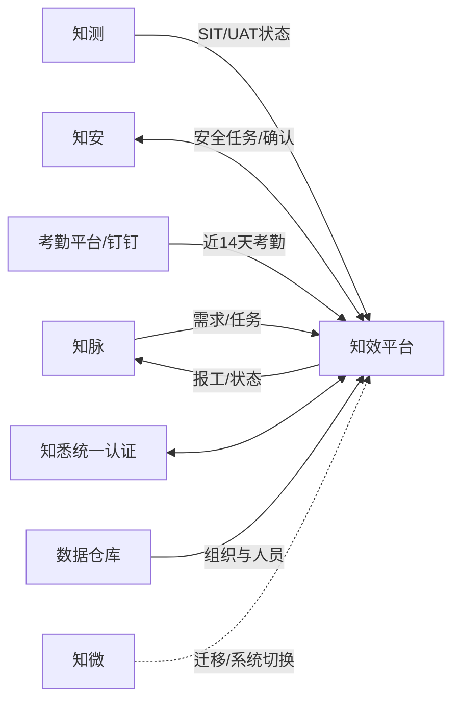

# 知效平台PRD规范化附件A
## 文档治理、范围与角色权限

> 文档编号：ZX-PRD-APP-A-2026　版本：V1.4-DRAFT　状态：待联合评审

> 返回[场景化PRD正文](知效平台建设需求规格说明书(SRS-PRD).md)；本附件负责文控、目标、边界、角色权限、术语和变更治理。

## 1. 文档控制

| 属性 | 内容 |
|---|---|
| 文档名称 | 知效平台PRD规范化附件A——文档治理、范围与角色权限 |
| 基线候选 | V1.4-DRAFT |
| 发布日期 | 2026-07-22 |
| 密级 | 商业秘密 / 内部公开 |
| 业务事实主源 | `source/知效平台建设需求说明书v1.2-0710.docx` |
| 补充分析来源 | `source/接口逻辑分析.md`、`source/表设计.md` |
| 编制责任 | 知效平台需求工程组 |
| 审批责任 | 业务负责人、PMO、架构、安全、测试、运维及外部系统负责人 |
| 当前状态 | 待联合评审；存在阻断性TBD，不得标记为正式批准 |

### 1.1 修订历史

| 版本 | 日期 | 说明 | 状态 |
|---|---|---|---|
| V1.0 | 2026-06-11 | 初始需求稿 | 历史版本 |
| V1.1 | 2026-06-24 | 修订；具体修订内容待版本差异确认 | 历史版本 |
| V1.2 | 2026-07-10 | 修订；具体修订内容待版本差异确认 | 原始业务事实基线 |
| V1.0-NORM | 2026-07-22 | 首次规范化整理 | 已被本候选版本取代 |
| V1.3-DRAFT | 2026-07-22 | 按需求工程标准重构并建立追踪关系 | 待联合评审 |
| V1.4-DRAFT | 2026-07-22 | 调整为场景化PRD正文与规范化附件结构 | 待联合评审 |

### 1.2 规范性引用

- ISO/IEC/IEEE 29148:2018，需求工程过程、需求信息项及良好需求属性。
- ISO/IEC 25010:2023，产品质量模型。
- ISO/IEC 25019:2023，使用质量模型。
- 长沙银行现行金融科技研发管理、安全、数据和上线管理规范。

IEEE 830-1998仅作为历史参考；该标准已被ISO/IEC/IEEE 29148取代，不作为本项目合规依据。

### 1.3 事实来源与冲突处理

1. 原始V1.2需求及其提取稿是业务规则主源。
2. 分析文档只可补充接口、数据或实现约束；与原始需求冲突时以原始需求为准。
3. 场景化PRD正文表达用户目标、用户旅程和业务意图；附件B中的`FR-*`是开发和验收使用的规范性功能需求，附件C/D分别控制接口数据及迁移/NFR/验收。
4. 正文与附件出现差异时必须登记为需求缺陷并联合澄清，不得静默选择或自行推断。
5. 无法从主源判定的内容不得推断为已确认需求，必须登记为`TBD-*`。
6. 需求变更必须记录变更原因、影响场景、需求ID、接口、测试、审批人、版本和验证结果。

## 2. 项目背景与业务目标

知微系统自2019年上线，承载研发过程管理、外包报工和时效基线考核。知效平台用于完成信创替代，并在迁移过程中保持核心业务连续性。

| ID | 业务目标 | 成功判据 | 来源 |
|---|---|---|---|
| BR-001 | 完成知微核心能力替代 | 范围内核心流程通过业务验收，切换后无P0业务中断 | 原始V1.2“项目背景/目标” |
| BR-002 | 提供研发价值流可视化 | 需求泳道、列表、甘特图及任务视图均可按权限使用 | 原始V1.2“需求管理视图” |
| BR-003 | 降低跨系统人工流转 | 知脉、知测、知安、考勤等已约定流程完成自动同步 | 原始V1.2“系统集成” |
| BR-004 | 支撑外包报工与考核连续性 | 报工、基线和历史考核数据按验收规则完成迁移与并行验证 | 原始V1.2“报工/基线/迁移” |
| BR-005 | 满足信创与行内合规要求 | 在批准的GoldenDB、TongWeb及统一认证环境通过兼容与安全测试 | 原始V1.2“创新改造” |

## 3. 范围

### 3.1 本期范围

- 创新改造：完成框架、中间件、数据库及插件等适配调整。
- 需求管理：按已确认阶段字典提供泳道、列表、甘特图、筛选、横幅、详情、自定义字段、风险和日志；原始需求列出的12个泳道状态与“13个阶段时效”表述存在差异，见`TBD-REQ-STAGE-001`。
- 任务管理：需求类、项目类、事务类和安全类任务，以及分发、认领、流转、子任务和模板。
- 报工管理：考勤同步、每日任务点亮、默认工时生成、个人报工、管理查看及知脉同步。
- 时效与基线：阶段停留、扣减、基线生成/取消/调出、加塞及计划偏差分析。
- 系统集成：知脉、知测、知安、知悉、考勤、数据仓库和知微迁移。
- 数据迁移与系统切换：迁移知微存量考核数据，支持知微、知效双数据接入，并按工号和日期避免重复同步。
- 原型设计：主页、个人工作台、需求管理视图、任务列表和报工管理页面。
- 性能与应用安全：按现有生产用户规模和最大同时在线用户数进行设计，并遵守行内应用安全规范。

### 3.2 非范围

- 重构知脉、知测、知安、知悉、钉钉或数据仓库自身业务功能。
- 替代行内统一身份、组织主数据、考勤审批或工时核算规则的主数据职责。
- 原始需求未明确要求的移动端、离线客户端和公众互联网访问。
- 本文档不批准具体物理部署拓扑、采购规模或生产密钥方案；这些由设计与上线评审确定。

### 3.3 假设、依赖与约束

| ID | 类型 | 内容 | 验证/责任方 |
|---|---|---|---|
| ASM-001 | 假设 | 外部系统能够提供稳定的唯一业务标识和变更时间 | 各外部系统负责人 |
| DEP-001 | 依赖 | 知脉提供需求、任务及报工核算接口/MQ契约 | 知脉负责人 |
| DEP-002 | 依赖 | 知测和知安提供测试状态与安全任务事件 | 知测、知安负责人 |
| DEP-003 | 依赖 | 考勤源提供近14天补卡、请假后的最新结果 | 考勤平台负责人 |
| CON-001 | 约束 | 后端以项目批准的Java 17技术基线建设 | 架构委员会 |
| CON-002 | 约束 | 数据库和中间件必须在批准的GoldenDB/TongWeb版本验证 | 架构、运维 |
| CON-003 | 约束 | 不在知效维护独立硬编码用户密码 | 安全负责人 |

## 4. 系统上下文

| 外部系统 | 数据责任 | 方向 | 触发规则 | 关联需求 |
|---|---|---|---|---|
| 知脉 | 需求、开发任务主数据及工时核算 | 双向 | 需求、任务按对接事件同步；报工每日同步，具体时刻及与默认工时生成的先后关系待确认 | FR-REQ-001、FR-TASK-001、FR-WH-012、TBD-JOB-002 |
| 知测 | SIT/UAT测试状态 | 入站 | 按SIT/UAT准入、准出事件同步；监控和补偿机制待接口确认 | FR-REQ-006 |
| 知安 | 安全要求与完成确认 | 双向 | 通过接口同步安全内容并回传完成确认；重试和补偿机制待接口确认 | FR-TASK-012～013 |
| 考勤平台/钉钉 | 外包考勤及补卡结果 | 入站 | 每日同步近14天数据；前一日考勤在08:00后应可用，默认工时须在08:00前生成，具体作业顺序和时刻见`TBD-JOB-002` | FR-WH-001～003、TBD-JOB-002 |
| 知悉 | 统一认证和权限上下文 | 双向 | 用户登录及令牌生命周期 | NFR-SEC-001 |
| 数据仓库 | 人员和组织主数据 | 入站 | 调度时间待接口确认 | TBD-INT-001 |
| 知微 | 历史数据和系统切换期间报工 | 入站 | 按迁移批次处理；切换期间支持知微、知效双数据接入并优先采用知效报工 | MIG-001、ROL-001 |

## 5. 角色与权限

### 5.1 角色

原始需求在不同功能中使用行领导、部门领导、部落长、中心经理、团队长、PMO、小队长、项目经理、系统设计师、开发人员、测试人员、外包员工、行方负责人和管理员等角色或业务身份。团队长与小队长在组织范围和功能权限上存在差异，不合并为同一角色。

原始需求未给出统一角色总数，也未明确管理员、行方负责人等身份与其他角色的映射关系。多角色叠加、跨组织兼职、临时授权以及上述身份映射统一由`TBD-SEC-001`确认；关闭前不得据此扩大数据权限。

### 5.2 权限矩阵

| 功能 | 角色/身份 | 已确认的权限或数据范围 |
|---|---|---|
| 需求横幅与组织视角 | 行领导、部门领导、部落长、中心经理、团队长、PMO | 默认加载本人管辖主部落；可切换其他部落及其下属小队，横幅与需求列表同步刷新 |
| 需求横幅与组织视角 | 小队长、项目经理、开发人员、测试人员、外包员工 | 无部落/小队切换权限；横幅固定展示本人所属部落小队，列表展示本人主办、辅办或参与的需求 |
| 需求进度查看 | 开发人员、测试人员、外包员工等任务参与人员 | 只有关联开发任务的人员可查看对应需求进度 |
| 任务列表 | 部门领导、部落长 | 部门或部落范围内全部待办，并包含个人待办和本人派发任务 |
| 任务列表 | 中心经理、团队长 | 部落或中心范围内全部待办，并包含重要类、OKR类及本人派发任务 |
| 任务列表 | PMO | 所属部门、部落或中心范围内全部待办，并包含重要类、OKR类、个人待办和本人派发任务 |
| 任务列表 | 项目经理 | 本人的各类待办及任务派发来源 |
| 任务列表 | 系统设计师、开发人员、测试人员 | 本人的各类待办及任务派发来源 |
| 任务创建 | 所有角色 | 需求类任务仅由知脉同步，知效不支持新建或删除；安全类任务由知安同步 |
| 任务创建 | 项目经理 | 可通过模板批量导入项目类任务；其他项目类创建权限待确认 |
| 任务创建 | 未明确 | 事务类任务支持创建、批量导入和分发，但原始需求未明确各角色的创建边界 |
| 我的报工 | 外包员工 | 查看、新增、修改和删除本人符合条件且未锁定的报工记录 |
| 报工查看 | 行方负责人 | 查看本人名下外包人员的报工数据 |
| 报工查看 | 中心经理、团队长 | 查看本中心外包人员的报工数据 |
| 报工查看 | 小队长 | 查看本小队外包人员的报工数据 |
| 报工查看 | PMO、部落长、部门领导、行领导 | 查看全部外包人员的报工数据 |
| 报工查看 | 其他行方用户 | 报工查看菜单仅向行方用户开放；其他角色的查看范围待确认 |
| 自定义字段 | 领导、管理员 | 可创建全局、部落级及以下范围字段 |
| 自定义字段 | 中心经理、团队长 | 可创建部落、小队和项目组范围字段 |
| 自定义字段 | 小队长 | 可创建小队和项目组范围字段 |
| 自定义字段 | 项目经理 | 仅可创建本项目组私有字段 |
| 自定义字段 | 开发人员、测试人员、外包员工 | 无新增、编辑字段权限，仅可查看有权访问的字段 |
| 阶段人工流转、风险操作、基线和扣减权限 | 各角色 | 原始需求未形成完整角色授权规则，关闭`TBD-SEC-003`前不得作为已批准权限实施 |

权限矩阵只记录原始需求已经明确的规则。角色叠加、身份映射和跨组织授权见`TBD-SEC-001`；阶段人工流转、风险操作、基线及扣减权限见`TBD-SEC-003`。

## 6. 术语

| 术语 | 定义 |
|---|---|
| 点亮 | 个人子任务处于“进行中”状态，纳入当日默认工时分摊的业务标记 |
| 报工窗口 | 早于当前日期且距当前日期不超过14个自然日（含）的可新增/调整日期范围 |
| 基线 | 每月5日按规则纳入当月计划完成需求形成的考核快照 |
| 基线取消 | 5日当日，已纳入基线但计划完成月改为其他月份 |
| 基线调出 | 5日之后，已纳入基线且计划完成月不再为当月 |
| 加塞 | 5日之后，未纳入基线但计划完成月为当月 |
| 阶段停留天数 | 原始需求定义为阶段离开时间（未离开时取当前时间）与进入时间之差，并考虑扣减；是否扣除节假日见`TBD-BASE-001`，扣减是否必须审批及审批角色见`TBD-SEC-003` |
| 逻辑接口 | 以一个业务资源和路径为单位的接口定义；同一路径多HTTP方法可归为一个逻辑接口 |

## 7. 待决事项与变更控制

| TBD | 问题 | 责任方 | 阻断对象 | 关闭条件 |
|---|---|---|---|---|
| TBD-INT-001 | 组织主数据调度时间、文件/API格式未确认 | 数据仓库/架构 | 接口基线 | 契约评审通过 |
| TBD-REQ-STAGE-001 | 原始需求列举12个泳道状态，但时效章节称“13个阶段”，最终阶段字典及映射未确认 | 业务/产品/知脉/知测 | 需求阶段、泳道和时效基线 | 阶段名称、顺序、外部触发和时效口径签字确认 |
| TBD-JOB-002 | 考勤同步、08:00前默认工时生成及每日知脉报工同步的执行顺序和具体时刻未确认 | 业务/架构/运维/知脉 | 报工作业基线 | 三类作业的依赖、完成时限、失败补偿和最终调度表签字确认 |
| TBD-SEC-001 | 角色总表、管理员/行方负责人等身份映射、多角色叠加、跨组织兼职和临时授权优先级未确认 | 安全/业务 | 角色与数据权限基线 | 角色定义、身份映射和权限合并规则签字确认 |
| TBD-SEC-003 | 阶段人工流转、风险操作、基线及扣减的操作边界、是否需要审批和角色授权规则未确认 | 业务/安全 | 功能权限基线 | 角色×操作×数据范围及适用审批链签字确认 |
| TBD-BASE-001 | 阶段停留“业务天数”是否排除周末、法定节假日及半天假未确认 | 业务/PMO | 时效计算基线 | 业务日历规则签字确认 |

任何需求变更均须提交变更单，记录受影响的需求ID、接口、数据、测试和上线计划；业务负责人、产品负责人及受影响专业评审人批准后方可进入下一候选版本。

数据表数量差异由附件C的`TBD-DATA-001`统一管理。
