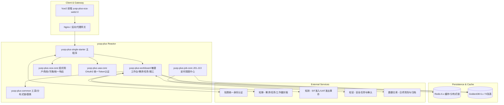
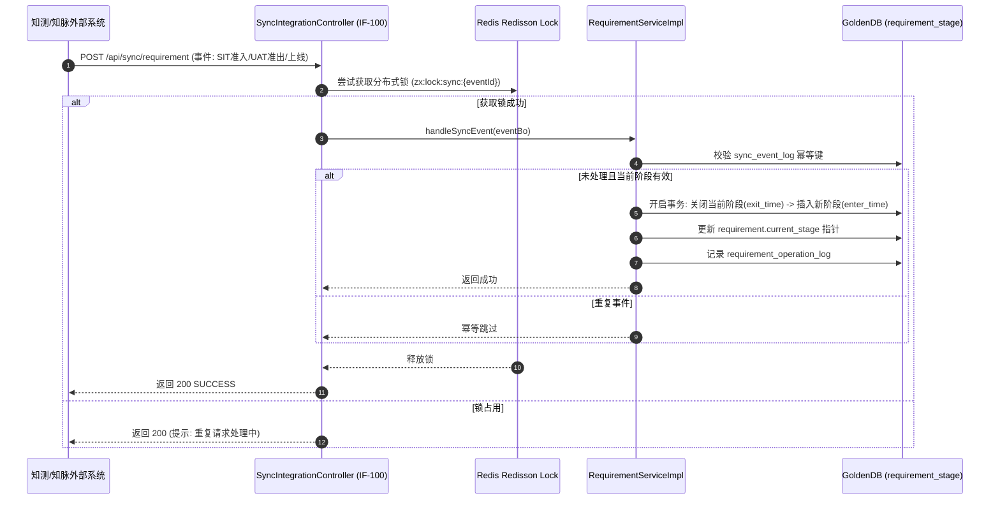
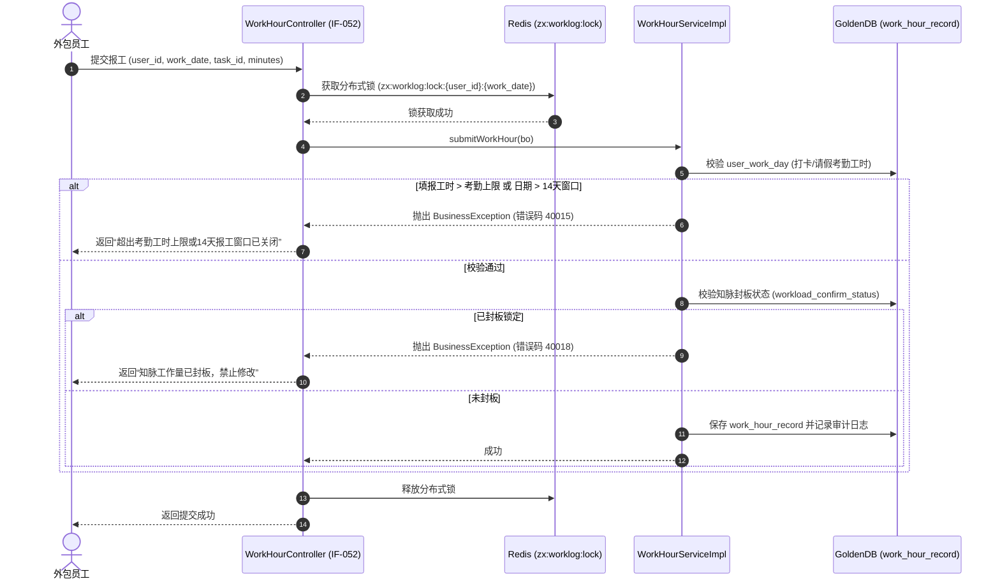
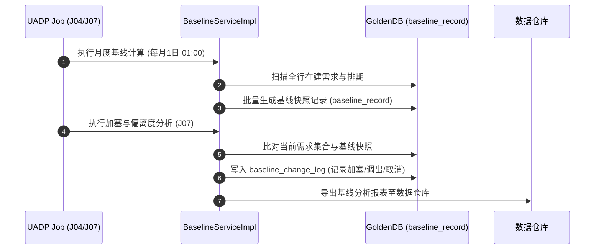

# 知效平台技术设计方案 (Tech Spec)

> **文档编号**：ZX-TEC-2026  
> **文档版本**：V2.0-FINAL（系统化重构版）  
> **文档状态**：团队协作标准基线（正式发布）  
> **更新日期**：2026-07-23  
> **面向视角**：系统架构师 / 后端研发 / 前端研发 / DBA / 运维工程师

---

## 1. 架构图与系统骨架对齐 (Architecture & Skeleton)

### 1.1 Maven Reactor 多模块架构映射

本系统基于 repository 中实际的 `yusp-plus` Reactor 多模块工程构建：

```
yusp-plus (Maven Reactor 父工程 - Java 17 / Spring Boot 3.4.5)
 ├── yusp-plus-single
 │    └── yusp-plus-single-starter      # [运行主入口] YuspPlusSingleStarterMicroserviceApp (单体部署模式)
 ├── yusp-plus-workboard                 # [知效业务核心] 敏捷协作、需求管理、任务分配、报工与看板控制层
 │    ├── controller                     # OcaWorkboardController, EsbController, FtpController
 │    ├── service/impl                   # OcaWorkboardServiceImpl
 │    └── dao / domain                   # OcaWorkboardDao, OcaWorkboardEntity, Msgm00001Req/Resp
 ├── yusp-plus-oca                       # [平台骨架核心] 基础组织用户与通用组件
 │    └── yusp-plus-oca-core             # AdminSmUserDao, AdminSmOrgDao, AdminSmDptDao, AdminSmDutyDao,
 │                                       # AdminSmRoleDao, AdminSmLookupDictDao, AdminSmLogDao
 │                                       # 统一响应封装: ResultWarpReturnValueHandler, RestApiResponseAdvice
 ├── yusp-plus-uaa                       # [统一认证服务] OAuth2 认证与 Token 存储
 │    └── yusp-plus-uaa-core             # OcaUserDetailsServiceImpl, CustomRedisTokenStore, CheckTokenController
 ├── yusp-plus-extend                    # [扩展能力模块] 调度与审计链路
 │    ├── yusp-plus-job-core             # UADP 批处理调度: ScheduleJobDao, ScheduleJobLogDao, ScheduleConfig
 │    └── yusp-plus-utrace-core          # 变更链路追踪: ModifyTraceDao, ModifyTraceController
 ├── yusp-plus-common                    # [公共基础库] 通用 Redis 工具、分布式锁、基类与异常处理
 ├── yusp-plus-dbinit                    # [数据库初始化] GoldenDB DDL (oca-init-20250915.sql, zhixiao-init-20260723.sql)
 └── yusp-plus-oca-web2.0                # [前端平台] Vue 2.6 / Element UI 前端工程
```

### 1.2 系统架构与组件图



---

## 2. 核心时序图 (Sequence Diagrams)

### 2.1 知测 SIT/UAT 及知脉上线自动拖卡时序图



### 2.2 外包人员每日点亮与并发报工 Redisson 锁时序图



### 2.3 J04 每月初基线快照与加塞分析时序图



---

## 3. 数据库与缓存设计 (Data Schema & Cache)

### 3.1 Redis 键规范与防击穿/穿透方案

| 键命名格式 (Redis Key Pattern) | 数据结构 | TTL 过期策略 | 防击穿/雪崩/穿透设计 |
|---|---|---|---|
| `zx:req:detail:{tenant_id}:{req_id}` | String (JSON) | 2小时 + Jitter(0-600s) | 防雪崩：随机偏移 TTL；防穿透：空对象缓存 (`{}`) 5 分钟 |
| `zx:worklog:lock:{user_id}:{date}` | Redisson Lock | 10 秒自动释放 | 防并发争用：分布式锁保障报工写操作单线程串行化 |
| `zx:user:perm:{user_id}` | Hash (角色/权限) | 30 分钟 (登出主动清除)| 高频读缓存：缓存用户组织角色矩阵，降低 DB 压力 |
| `zx:bloom:req_code` | Bloom Filter | 永久 (增量追加) | 防穿透：拦截非法需求编号查询 |

---

## 4. 异常处理与兜底策略 (Resilience)

### 4.1 外部集成降级与重试
* **异常队列**：外部系统 (知脉/知测/知安) 接口超时或 5xx 异常时，异步落库至 `sync_conflict`。
* **作业补偿**：由 `yusp-plus-job-core` 中的 J01、J10、J11 作业每 15 分钟扫表重试 3 次退避。

### 4.2 幂等性控制
* **MD5 幂等键**：基于请求 Header `reqJnls` + `transName` + `data_tenant_id` 生成 MD5 防重 Key 存入 Redis，有效期 30 秒。

---

## 5. 非功能性需求 (NFR)


