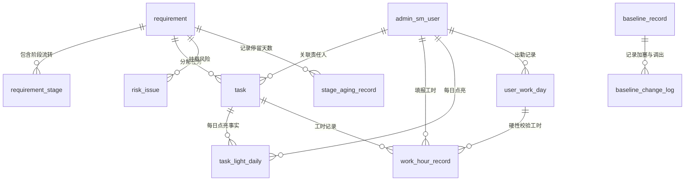

# 知效平台数据库设计说明书 (DB Design)

> **文档编号**：ZX-DB-2026  
> **文档版本**：V2.0-FINAL（系统化重构版）  
> **文档状态**：团队协作标准基线（正式发布）  
> **更新日期**：2026-07-23  
> **面向视角**：DBA / 数据架构师 / 后端研发

---

## 1. 数据库总体规范与公共字段

### 1.1 容量与 GoldenDB 部署规范
* **数据库引擎**：GoldenDB 6.x (MySQL 8.0.21 协议)，字符集 `utf8mb4`，排序规则 `utf8mb4_bin`。
* **数据表总数**：全系统共计 **73 张核心相关表**（包含 **8 张 OCA 基础平台复用表** + **65 张知效自建业务表**）。
* **主键与标识规范**：知效自建表主键及关联 `user_id`、`org_id`、`pm_id` 统一使用 `varchar(32)` UUID；外部系统业务标识统一使用 `varchar(100)`。

### 1.2 公共审计与隔离字段
所有知效自建表均包含以下公共字段：

```sql
`data_tenant_id`  varchar(32)   NOT NULL DEFAULT 'DEFAULT' COMMENT '租户ID',
`created_by`      varchar(32)   DEFAULT NULL COMMENT '创建人ID (关联 admin_sm_user.USER_ID)',
`create_time`     datetime      NOT NULL DEFAULT CURRENT_TIMESTAMP COMMENT '创建时间',
`updated_by`      varchar(32)   DEFAULT NULL COMMENT '修改人ID',
`update_time`     datetime      NOT NULL DEFAULT CURRENT_TIMESTAMP ON UPDATE CURRENT_TIMESTAMP COMMENT '修改时间',
`delete_flag`     tinyint(1)    NOT NULL DEFAULT '0' COMMENT '逻辑删除: 0未删除 1已删除',
`version`         int(11)       NOT NULL DEFAULT '0' COMMENT '乐观锁版本号'
```

---

## 2. 实体关系图 (Mermaid ERD)



---

## 3. 73 张核心数据库表结构明细表 (整合《表设计.md》)

### 3.1 用户、组织与项目数据域 (DATA-ORG - 17 张表)

#### A. 8 张基础平台复用表 (OCA 骨架)
1. **`admin_sm_user`**：用户信息/账号表（包含 `USER_ID`, `LOGIN_CODE`, `USER_NAME`, `ORG_ID`, `DPT_ID`, `USER_STS` 等 38 字段）。
2. **`admin_sm_org`**：机构/组织架构表（包含 `ORG_ID`, `ORG_CODE`, `ORG_NAME`, `UP_ORG_ID`, `ORG_LEVEL`, `ORG_STS` 等 15 字段）。
3. **`admin_sm_dpt`**：部门表（包含 `DPT_ID`, `DPT_CODE`, `DPT_NAME`, `ORG_ID`, `UP_DPT_ID`, `DPT_STS` 等 9 字段）。
4. **`admin_sm_duty`**：岗位表（包含 `DUTY_ID`, `DUTY_CODE`, `DUTY_NAME`, `ORG_ID`, `DUTY_STS` 等 9 字段）。
5. **`admin_sm_user_duty_rel`**：用户岗位关联表（包含 `REL_ID`, `USER_ID`, `DUTY_ID` 等 7 字段）。
6. **`admin_sm_user_mgr_org`**：用户可管理机构权限表（包含 `REL_ID`, `USER_ID`, `ORG_ID` 等 7 字段）。
7. **`admin_sm_role`**：角色定义表（包含 `ROLE_ID`, `ROLE_CODE`, `ROLE_NAME`, `ROLE_STS` 等 9 字段）。
8. **`admin_sm_user_role_rel`**：用户角色关联表（包含 `REL_ID`, `USER_ID`, `ROLE_ID` 等 7 字段）。

#### B. 9 张知效扩展表
9. **`tribe`**：敏捷部落表（`tribe_id`, `tribe_code`, `tribe_name`, `leader_user_id`）。
10. **`tribe_team`**：部落下属小队表（`team_id`, `tribe_id`, `team_name`, `team_leader_id`）。
11. **`user_tribe_team`**：人员部落/小队归属表（`rel_id`, `user_id`, `tribe_id`, `team_id`, `user_type`）。
12. **`user_profile_ext`**：用户扩展属性表（`ext_id`, `user_id`, `external_employee_no`, `vendor_company_id`）。
13. **`dev_system_module`**：研发系统与模块主数据扩展表（`module_id`, `system_code`, `system_name`, `owner_user_id`）。
14. **`user_system_rel`**：人员与系统模块归属关系表（`rel_id`, `user_id`, `module_id`, `role_type`）。
15. **`project`**：项目主表（`project_id`, `project_code`, `project_name`, `pm_id`, `project_status`）。
16. **`project_member`**：项目成员关联表（`member_id`, `project_id`, `user_id`, `project_role`）。
17. **`vendor_company`**：外包合作公司表（`company_id`, `company_code`, `company_name`, `contact_phone`）。

---

### 3.2 需求管理数据域 (DATA-REQ - 17 张表)

18. **`requirement`**：需求主表（`req_id`, `req_code`, `title`, `current_stage`, `pm_id`, `dept_id`, `planned_online_date`, `risk_status`, `archive_status`）。
19. **`requirement_stage`**：需求阶段流转明细表（`stage_id`, `req_id`, `stage_code`, `enter_time`, `exit_time`, `stay_minutes`, `deduct_minutes`, `effective_stay_days`, `is_current`）。
20. **`requirement_stage_log`**：需求阶段变更日志表（`log_id`, `req_id`, `from_stage`, `to_stage`, `operation_type`, `reason`, `operator_id`）。
21. **`requirement_operation_log`**：需求业务操作审计表（`log_id`, `req_id`, `action_code`, `before_value`, `after_value`, `operator_id`）。
22. **`requirement_memo`**：需求备忘录/纪要表（`memo_id`, `req_id`, `content`, `author_id`）。
23. **`risk_issue`**：需求风险与问题表（`risk_id`, `req_id`, `risk_type`, `severity`, `description`, `assignee_id`, `status`）。
24. **`requirement_comment`**：需求评论讨论表（`comment_id`, `req_id`, `content`, `user_id`）。
25. **`requirement_attachment`**：需求业务附件关联表（`att_id`, `req_id`, `file_id`, `file_name`, `file_size`）。
26. **`requirement_tag`**：需求标签关联表（`tag_rel_id`, `req_id`, `tag_name`）。
27. **`custom_field_definition`**：自定义字段定义表（`field_id`, `scope_level`, `scope_id`, `field_key`, `field_name`, `field_type`）。
28. **`custom_field_value`**：自定义字段取值表（`val_id`, `field_id`, `req_id`, `string_value`, `number_value`, `date_value`）。
29. **`requirement_display_setting`**：列表个人显示列配置表（`setting_id`, `user_id`, `columns_json`, `widths_json`）。
30. **`requirement_statistics`**：需求每日指标统计快照表（`stat_id`, `stat_date`, `dept_id`, `total_count`, `overdue_count`）。
31. **`requirement_participant`**：需求关联干系人表（`part_id`, `req_id`, `user_id`, `role_type`）。
32. **`requirement_plan_change_log`**：排期变更历史表（`change_id`, `req_id`, `old_date`, `new_date`, `reason`）。
33. **`custom_field_visibility`**：自定义字段可见性表（`vis_id`, `field_id`, `role_id`）。
34. **`requirement_filter_setting`**：个人保存筛选方案表（`filter_id`, `user_id`, `filter_name`, `conditions_json`）。

---

### 3.3 任务管理数据域 (DATA-TASK - 7 张表)

35. **`task`**：任务主表（`task_id`, `req_id`, `project_id`, `task_type`, `task_name`, `assignee_id`, `status`, `estimated_workload`, `allow_work_hour`）。
36. **`task_collaborator`**：任务协同参与人表（`collab_id`, `task_id`, `user_id`, `role_type`）。
37. **`task_change_log`**：任务状态与属性变更表（`log_id`, `task_id`, `field_name`, `old_val`, `new_val`, `operator_id`）。
38. **`task_template`**：项目类任务导入模版表（`template_id`, `template_name`, `content_json`）。
39. **`security_check_task`**：知安安全检查任务表（`sec_task_id`, `req_id`, `task_id`, `sec_requirements`, `sec_design_points`, `confirm_status`, `confirm_user_id`）。
40. **`task_dependency`**：任务间前后置依赖表（`dep_id`, `pre_task_id`, `post_task_id`, `dep_type`）。
41. **`task_light_daily`**：外包每日点亮事实表（`light_id`, `user_id`, `work_date`, `task_id`, `light_status`）。

---

### 3.4 报工管理数据域 (DATA-WH - 6 张表)

42. **`work_hour_record`**：工时报工记录表（`record_id`, `user_id`, `task_id`, `work_date`, `work_minutes`, `confirm_status`, `remark`）。
43. **`attendance_sync_record`**：考勤平台同步记录表（`att_id`, `user_id`, `work_date`, `clock_in_time`, `clock_out_time`, `leave_minutes`, `valid_work_minutes`）。
44. **`work_hour_modify_log`**：工时修改与补报审计日志表（`log_id`, `record_id`, `old_minutes`, `new_minutes`, `reason`, `operator_id`）。
45. **`work_hour_summary`**：月度工时汇总快照表（`summary_id`, `user_id`, `year_month`, `total_minutes`, `lock_status`）。
46. **`work_hour_config`**：报工参数配置表（`config_id`, `config_key`, `config_value`）。
47. **`user_work_day`**：人员每日考勤与报工状态总表（`work_day_id`, `user_id`, `work_date`, `is_work_day`, `daily_max_minutes`, `light_count`）。

---

### 3.5 时效与基线数据域 (DATA-BASE - 7 张表)

48. **`stage_aging_record`**：阶段停留时效统计表（`aging_id`, `req_id`, `stage_code`, `stay_days`, `deduct_days`, `effective_days`）。
49. **`baseline_record`**：月度基线快照主表（`baseline_id`, `year_month`, `req_id`, `planned_online_date`, `baseline_status`）。
50. **`baseline_change_log`**：基线加塞/调出变更日志表（`change_id`, `baseline_id`, `req_id`, `change_type`, `reason`, `approver_id`）。
51. **`aging_statistics`**：阶段停留耗时大盘聚合表（`stat_id`, `stat_date`, `stage_code`, `avg_days`, `max_days`）。
52. **`stage_deduction_request`**：阶段扣减申请审批表（`request_id`, `req_id`, `stage_code`, `deduct_days`, `reason`, `proof_file_id`, `status`）。
53. **`work_calendar`**：节假日与工作日历表（`calendar_id`, `calendar_date`, `is_work_day`, `holiday_name`）。
54. **`baseline_rule_version`**：基线考核规则版本表（`rule_id`, `version_code`, `rule_config_json`）。

---

### 3.6 同步、迁移、灰度与审计数据域 (DATA-SYNC - 19 张表)

55. **`sync_requirement`**：知脉需求同步事件表。
56. **`sync_task`**：知脉任务同步事件表。
57. **`sync_user`**：数据仓库人员主数据同步表。
58. **`sync_organization`**：数据仓库组织架构同步表。
59. **`sync_work_hour`**：知脉工时同步写回事件表。
60. **`sync_security_task`**：知安事件同步表。
61. **`sync_conflict`**：乱序与异常同步事件冲突表。
62. **`sync_incremental_change`**：知微/知效双向增量清洗日志表。
63. **`sync_batch_record`**：定时批处理调度批次记录表。
64. **`sync_mapping_relation`**：知微旧标识与知效新 ID 映射表。
65. **`sync_config`**：同步接口参数配置表。
66. **`sync_event_log`**：全量外部事件落库日志表。
67. **`migration_batch_item`**：历史数据迁移批次明细表。
68. **`gray_release_rule`**：双系统灰度切流规则表。
69. **`gray_release_batch`**：灰度扩围批次表。
70. **`gray_release_metric_snapshot`**：灰度并行比对指标快照表。
71. **`gray_route_decision`**：灰度路由决策日志表。
72. **`archive_object_locator`**：已归档数据定位器表。
73. **`business_audit_log`**：核心业务操作审计日志表（只追加不删除）。

---

## 4. 全量通用数据字典 (Lookup Dictionary)

对应 `admin_sm_lookup_dict` 字典表：

| 字典分类 (Dict Code) | 枚举编码 (Item Key) | 中文标签 (Item Label) | 说明 |
|---|---|---|---|
| `REQ_STAGE` | `PENDING_ACCEPTANCE` | 待受理 | 13 标准阶段 1 |
| `REQ_STAGE` | `IN_DEVELOPMENT` | 研发中 | 13 标准阶段 6 |
| `REQ_STAGE` | `IN_SIT` | SIT中 | 13 标准阶段 8 (知测事件自动触发) |
| `REQ_STAGE` | `DEPLOYED` | 已上线 | 13 标准阶段 12 (知脉事件触发) |
| `REQ_STAGE` | `ARCHIVED` | 已归档 | 13 标准阶段 13 (上线满90天J13归档) |
| `TASK_TYPE` | `REQUIREMENT` | 需求类任务 | 知脉同步，可计工时 |
| `TASK_TYPE` | `PROJECT` | 项目类任务 | 手工创建/导入，可计工时 |
| `TASK_TYPE` | `AFFAIR` | 事务类任务 | 全员创建，**严禁点亮与报工** |
| `TASK_TYPE` | `SECURITY` | 安全类任务 | 知安同步，开发二次确认 |

---

## 5. 数据生命周期与归档策略

1. **在线日志数据策略**：
   * `requirement`, `task`, `work_hour_record` 保留当年及前 3 年数据。
   * `business_audit_log`, `sync_event_log` 追加日志只增不删，至少保留 3 年在线查询。
2. **J13 归档与数据仓库转存**：
   * 上线满 90 天的需求自动触发 `ARCHIVED` 状态。
   * 日终 J13 批处理作业定期将冷数据打包转存至全行统一数据仓库 (Data Warehouse)。
