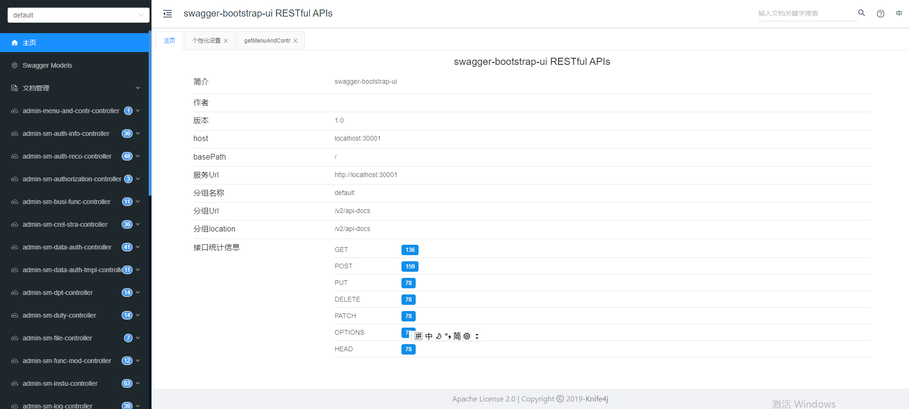
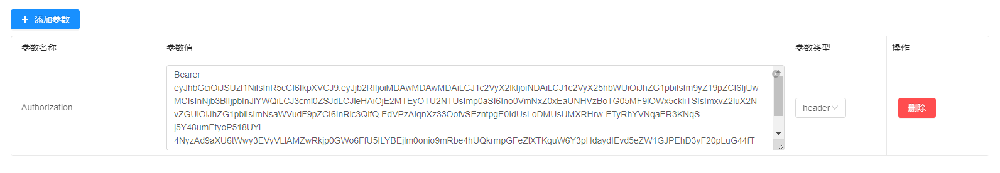

<p align="center" >
   <H1>yusp-plus-single</H1>
</p>

## Introduction

yusp-plus-single通过引入yusp-plus-oca-core和yusp-plus-uaa-core集成了认证授权、权限管理的单体spring boot系统，使用方式同yusp-plus系统一致。

### swagger使用流程

1、swagger的登录地址：http://ip:port/doc.html; 例：http://localhost:9001/doc.html
***
2、swagger的登录页面；
***

3、添加token请求头
***

4、token的获取可以参考前端发起请求的请求头，将Authorization字段的值进行复制。

### 单体配置文件配置：
- 1、认证配置： 认证方式是oca
- 1.1 后端配置：把配置文件yusp-plus/yusp-plus-single/yusp-plus-single-starter/src/main/resources/config/application.yml中的uaa.service-env.single修改为true，然后直接启动单体就可以；
- 1.2 前端配置：修改yusp-plus/yusp-plus-oca-web2.0/.env.development配置文件，VUE_APP_BASE_API = 'http://单体启动ip:单体端口',UE_APP_SINGLE_SERVER = true;


- 2、功能权限过滤器配置：yusp-plus/yusp-plus-single/yusp-plus-single-starter/src/main/resources/config/application.yml
- 2.1 开启功能权限过滤器：yusp.filter.access.enabled: true 开启功能权限过来器AccessFilter；
- 2.2 功能权限白名单url：AccessFilter拦截请求，从token中userId，如果没有获取到，就会报403错误；如果url配置到访问白名单中，则不会拦截，直接放行。因此获取token前、获取token和不需要token的相关接口都要设置到白名单中:
```yaml
  yusp:
    web:
      ignoreUrls: /api/login/queryuserandchecksecret,/v2/api-docs,/api/login/getuserinfowiththirdparty,/api/login/getuserinfoforpassword/*
```

- 2.3 数据权限白名单api:如果yusp-plus-oca-core中引入了yusp-commons-starter-data-authority数据权限的jar包，DataAuthorityWebFilter就会拦截请求， 从token中userId；如果对应的api配置到访问白名单中，则不会拦截，直接放行。因此通权限拦截一样，获取token前、获取token和不需要token的相关接口都要设置到白名单中:
```yaml
  yusp:
    data-authority:
      ignoredApi: /api/login/queryuserandchecksecret,/v2/api-docs,/api/login/getuserinfowiththirdparty,/api/login/getuserinfoforpassword/*
```

### 接入第三方认证扩展：
- 1、请求/oauth2/token接口参数grant_type=third_party
- 2、接入第三方认证扩展需要继承cn.com.yusys.yusp.uaa.provider.ExpandAuthenticationProvider，重写authenticationChecks()方法，具体可以参考cn.com.yusys.yusp.uaa.provider.ExampSingleAuthenticationProvider
- 3、添加扩展类全路径配置uaa.third-auth.provider-class=cn.com.yusys.yusp.uaa.provider.ExampSingleAuthenticationProvider