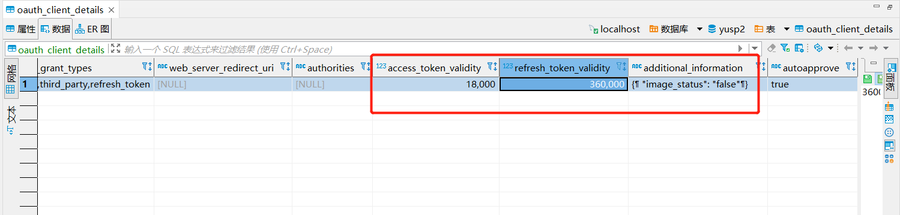

   <H1>yusp-plus-uaa</H1>

## Introduction
yusp-plus-uaa是一个认证中心，其核心设计目标是颁发token，解决登录问题。

## Features
- 1、简单：不需要任何额外的配置便可启动，满足基础的认证功能。
- 2、标准：所有的认证操作均满足oauth2标准。
- 3、可定制：支持新的授权模型，可以根据需求进行定制化开发。

## Development
- 1、支持基础的认证服务
- 2、支持多种授权类型:password、oca、third_party、refresh_token
## instructions
### uaa功能介绍
- 1、单体服务中直接引入了uaa包，通过oca的方式进行授权；微服务直接启动uaa服务，与yusp-plus-gateway，yusp-plus-oca绑定在一起，实现统一开发平台的基础功能，其中uaa作为认证服务中心，授权方式是oca。
- 2、作为token的颁发中心，由外部系统进行认证，根据认证结果颁发token。
### 文件位置
- 1、基础配置文件： 基础配置文件存放于yusp-plus/yusp-plus-uaa/yusp-plus-uaa-starter/src/main/resources/config/application.yml.apollo,application.yml.apollo , bootstrap.yml,bootstrap-nacos.yml,bootstrap-apollo.yml
  >> 通过bootstrap中的spring.profiles.active激活对应的配置文件
  
- 2、证书容器存放位置： 证书容器存放于yusp-plus/yusp-plus-uaa/yusp-plus-uaa-starter/src/main/resources/keystore.jks

## Uaa场景
### 如何修改token过期时间以及配置图片验证码功能
配置图片验证码与token时间,打开表oauth_client_details，其中access_token_validity字段配置token的过期时间（单位s）， refresh_token_validity字段配置刷新token的过期时间（单位s）,additional_information配置图片验证码是否生效，若要图片验证码生效，将additional_information字段设置为{"image_status": "false"}。
***

### 如何区分单体和微服务的认证：
- 1、单体认证： 认证方式是oca
  - 后端配置：把配置文件yusp-plus/yusp-plus-single/yusp-plus-single-starter/src/main/resources/config/application.yml中的uaa.service-env.single修改为true，然后直接启动单体就可以；
  - 前端配置：修改yusp-plus/yusp-plus-oca-web2.0/.env.development配置文件，VUE_APP_BASE_API = 'http://单体启动ip:单体端口',UE_APP_SINGLE_SERVER = true;

- 2、微服务认证：认证方式是oca
  - 前端配置：修改yusp-plus/yusp-plus-oca-web2.0/.env.development配置文件，VUE_APP_BASE_API = 'http://网关ip:网关端口',UE_APP_SINGLE_SERVER = false;

### 接入第三方认证扩展：
- 1、请求/oauth2/token接口参数grant_type=third_party
- 2、接入第三方认证扩展需要继承cn.com.yusys.yusp.uaa.provider.ExpandAuthenticationProvider，重写authenticationChecks()方法，具体可以参考cn.com.yusys.yusp.uaa.provider.ExampAuthenticationProvider
- 3、添加扩展类全路径配置uaa.third-auth.provider-class=cn.com.yusys.yusp.uaa.provider.ExampAuthenticationProvider